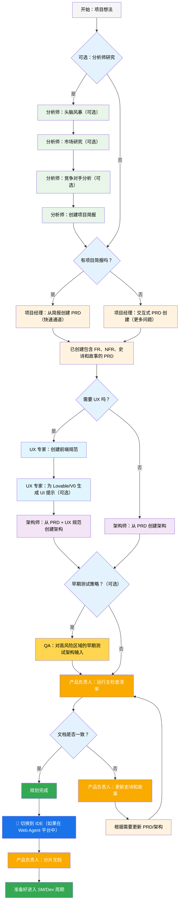

# BMad 方法 — 用户指南

本指南将帮助您理解并有效使用 BMad 方法进行敏捷的 AI 驱动规划和开发。

## BMad 规划和执行工作流程

首先，这是完整的标准绿地规划 + 执行工作流程。褐地项目非常相似，但建议先在一个简单的项目上理解这个绿地工作流程，然后再处理褐地项目。BMad 方法需要安装到新项目文件夹的根目录。对于规划阶段，您可以选择使用功能强大的 Web Agent 来执行，这可能会以比您自己提供 API 密钥或积分在某些 Agent 工具中完成所需成本的一小部分获得更高质量的结果。对于规划，强大的思维模型和更大的上下文——以及与 Agent 合作——将获得最佳结果。

如果您要在褐地项目（现有项目）中使用 BMad 方法，请查看**[在褐地项目中工作](./working-in-the-brownfield.md)**。

如果下面的图表无法呈现，请在 VSCode（或其派生版本之一）中安装 Markdown All in One 以及 Markdown Preview Mermaid Support 插件。安装这些插件后，当您右键单击打开的选项卡时，应该会有一个“打开预览”选项，或者查看 IDE 文档。

### 规划工作流程（Web UI 或强大的 IDE Agent）

在开发开始之前，BMad 遵循一个结构化的规划工作流程，理想情况下在 Web UI 中完成以提高成本效益：



#### Web UI 到 IDE 的转换

**关键转换点**：一旦产品负责人确认文档一致，您必须从 Web UI 切换到 IDE 以开始开发工作流程：

1.  **将文档复制到项目**：确保 `docs/prd.md` 和 `docs/architecture.md` 在您项目的 docs 文件夹中（或您在安装过程中可以指定的自定义位置）
2.  **切换到 IDE**：在您首选的 Agentic IDE 中打开您的项目
3.  **文档分片**：使用产品负责人 Agent 先分片 PRD，然后分片架构
4.  **开始开发**：开始接下来的核心开发周期

#### 规划产物（标准路径）

```text
PRD              → docs/prd.md
架构     → docs/architecture.md
分片的史诗    → docs/epics/
分片的故事  → docs/stories/
QA 评估   → docs/qa/assessments/
QA 门禁         → docs/qa/gates/
```

### 核心开发周期 (IDE)

一旦规划完成并且文档被分片，BMad 将遵循一个结构化的开发工作流程：

```mermaid
graph TD
    A["开发阶段开始"] --> B["SM：审查上一个故事的开发/QA 说明"]
    B --> B2["SM：从分片的史诗 + 架构中起草下一个故事"]
    B2 --> S{"高风险故事？（可选）"}
    S -->|是| T["QA：对草稿故事进行 *risk + *design"]
    S -->|否| B3
    T --> U["已创建测试策略和风险概况"]
    U --> B3{"产品负责人：验证故事草稿（可选）"}
    B3 -->|请求验证| B4["产品负责人：根据产物验证故事"]
    B3 -->|跳过验证| C{"用户批准"}
    B4 --> C
    C -->|已批准| D["开发：顺序执行任务"]
    C -->|需要更改| B2
    D --> E["开发：实施任务 + 测试"]
    E --> V{"开发中期 QA 检查？（可选）"}
    V -->|是| W["QA：*trace 或 *nfr 进行早期验证"]
    V -->|否| F
    W --> X["开发：解决覆盖率/NFR 差距"]
    X --> F["开发：运行所有验证"]
    F --> G["开发：标记为准备审查 + 添加说明"]
    G --> H{"用户验证"}
    H -->|请求 QA 审查| I["QA：测试架构师审查 + 质量门"]
    H -->|未经 QA 批准| M["重要提示：验证所有回归测试和 Linting 是否通过"]
    I --> J["QA：测试架构分析 + 主动重构"]
    J --> L{"QA 决策"}
    L -->|需要开发工作| D
    L -->|已批准| M
    H -->|需要修复| D
    M --> N["重要提示：在继续之前提交您的更改！"]
    N --> Y{"需要更新门禁吗？"}
    Y -->|是| Z["QA：*gate 更新状态"]
    Y -->|否| K
    Z --> K["将故事标记为完成"]
    K --> B

    style A fill:#f5f5f5,color:#000
    style B fill:#e8f5e9,color:#000
    style B2 fill:#e8f5e9,color:#000
    style S fill:#e3f2fd,color:#000
    style T fill:#ffd54f,color:#000
    style U fill:#ffd54f,color:#000
    style B3 fill:#e3f2fd,color:#000
    style B4 fill:#fce4ec,color:#000
    style C fill:#e3f2fd,color:#000
    style D fill:#e3f2fd,color:#000
    style E fill:#e3f2fd,color:#000
    style V fill:#e3f2fd,color:#000
    style W fill:#ffd54f,color:#000
    style X fill:#e3f2fd,color:#000
    style F fill:#e3f2fd,color:#000
    style G fill:#e3f2fd,color:#000
    style H fill:#e3f2fd,color:#000
    style I fill:#f9ab00,color:#fff
    style J fill:#ffd54f,color:#000
    style K fill:#34a853,color:#fff
    style L fill:#e3f2fd,color:#000
    style M fill:#ff5722,color:#fff
    style N fill:#d32f2f,color:#fff
    style Y fill:#e3f2fd,color:#000
    style Z fill:#ffd54f,color:#000
```



## 先决条件

在安装 BMad 方法之前，请确保您已具备：

- **Node.js** ≥ 18, **npm** ≥ 9
- **Git** 已安装并配置
- **（可选）** VS Code 及“Markdown All in One”+“Markdown Preview Mermaid Support”扩展

## 安装

### 可选

如果您想在 Web 上使用 Claude (Sonnet 4 或 Opus)、Gemini Gem (2.5 Pro) 或自定义 GPT 进行规划：

1.  导航到 `dist/teams/`
2.  复制 `team-fullstack.txt`
3.  创建新的 Gemini Gem 或 CustomGPT
4.  上传文件并附上说明：“您关键的操作说明已附上，请勿按指示打破角色”
5.  输入 `/help` 查看可用命令

### IDE 项目设置

```bash
# 交互式安装（推荐）
npx bmad-method install
```

### OpenCode

BMAD 通过项目级的 `opencode.jsonc`/`opencode.json`（仅限 JSON，无 Markdown 回退）与 OpenCode 集成。

- 安装：
  - 运行 `npx bmad-method install` 并在 IDE 列表中选择 `OpenCode`。
  - 安装程序将检测现有的 `opencode.jsonc`/`opencode.json`，如果缺少则创建一个最小的 `opencode.jsonc`。
  - 它将：
    - 确保 `instructions` 包含 `.bmad-core/core-config.yaml`（以及每个选定扩展包的 `config.yaml`）。
    - 使用文件引用（`{file:./.bmad-core/...}`）合并 BMAD Agent 和命令，幂等地。
    - 保留其他顶级字段和用户定义的条目。

- 前缀和冲突：
  - 您可以选择为 Agent 键添加 `bmad-` 前缀，为命令键添加 `bmad:tasks:` 前缀，以避免名称冲突。
  - 如果某个键已存在且非 BMAD 管理，安装程序将跳过它并建议启用前缀。

- 添加的内容：
  - `instructions`：`.bmad-core/core-config.yaml` 以及任何选定扩展包的 `config.yaml` 文件。
  - `agent`：来自核心和选定包的 BMAD Agent。
    - `prompt`：`{file:./.bmad-core/agents/<id>.md}`（或包路径）
    - `mode`：对于编排器为 `primary`，否则为 `all`
    - `tools`：`{ write: true, edit: true, bash: true }`
    - `description`：从 Agent 的 `whenToUse` 中提取
  - `command`：来自核心和选定包的 BMAD 任务。
    - `template`：`{file:./.bmad-core/tasks/<id>.md}`（或包路径）
    - `description`：从任务的“目的”部分提取

- 仅限选定包：
  - 安装程序仅包含您在上一步中选择的包（核心和所选包）中的 Agent 和任务。

- 更改后刷新：
  - 重新运行：
    ```bash
    npx bmad-method install -f -i opencode
    ```
  - 安装程序会安全地更新条目而不会重复，并保留您的自定义字段和注释。

- 可选的便捷脚本：
  - 您可以在项目的 `package.json` 中添加一个脚本以进行快速刷新：
    ```json
    {
      "scripts": {
        "bmad:opencode": "bmad-method install -f -i opencode"
      }
    }
    ```

### Codex (CLI & Web)

BMAD 通过 `AGENTS.md` 和提交的核心 Agent 文件与 OpenAI Codex 集成。

- 两种安装模式：
  - Codex（仅限本地）：保持 `.bmad-core/` 被忽略以进行本地开发。
    - `npx bmad-method install -f -i codex -d .`
  - 启用 Codex Web：确保 `.bmad-core/` 被跟踪，以便您可以为 Codex Web 提交它。
    - `npx bmad-method install -f -i codex-web -d .`

- 生成的内容：
  - 项目根目录下的 `AGENTS.md`，其中包含一个 BMAD 部分，内容包括
    - 如何与 Codex (CLI & Web) 一起使用
    - Agent 目录（标题、ID、何时使用）
    - 每个 Agent 的详细部分，包括源路径、何时使用、激活短语和 YAML
    - 带有快速使用说明的任务
  - 如果存在 `package.json`，则会添加有用的脚本：
    - `bmad:refresh`、`bmad:list`、`bmad:validate`

- 使用 Codex：
  - CLI：在项目根目录中运行 `codex` 并自然地提示，例如，“作为开发人员，实施……”。
  - Web：提交 `.bmad-core/` 和 `AGENTS.md`，然后在 Codex 中打开存储库并以相同的方式提示。

- 更改后刷新：
  - 重新运行适当的安装模式（`codex` 或 `codex-web`）以更新 `AGENTS.md` 中的 BMAD 块。

## 特殊 Agent

有两个 BMad Agent——未来它们将被合并为一个 BMad-Master。

### BMad-Master

该 Agent 可以执行所有其他 Agent 能做的任何任务或命令，除了实际的故事实施。此外，该 Agent 可以在 Web 上通过访问知识库来帮助解释 BMad 方法，并向您解释有关该过程的任何内容。

如果您不想在除了开发之外的不同 Agent 之间切换，那么这个 Agent 就是为您准备的。只需记住，随着上下文的增长，Agent 的性能会下降，因此重要的是指示 Agent 压缩对话并使用压缩后的对话作为初始消息开始新的对话。请经常这样做，最好在每个故事实施后都这样做。

### BMad-Orchestrator

该 Agent 不应在 IDE 中使用，它是一个重量级的、特殊用途的 Agent，利用大量上下文并且可以变形为任何其他 Agent。它仅用于促进 Web 包中的团队。如果您使用 Web 包，您将受到 BMad Orchestrator 的欢迎。

### Agent 如何工作

#### 依赖系统

每个 Agent 都有一个 YAML 部分，用于定义其依赖项：

```yaml
dependencies:
  templates:
    - prd-template.md
    - user-story-template.md
  tasks:
    - create-doc.md
    - shard-doc.md
  data:
    - bmad-kb.md
```

**关键点：**

- Agent 只加载它们需要的资源（精简上下文）
- 依赖项在捆绑过程中自动解析
- 资源在 Agent 之间共享以保持一致性

#### Agent 交互

**在 IDE 中：**

```bash
# 一些 IDE，例如 Cursor 或 Windsurf，使用手动规则，因此交互是通过“@”符号完成的
@pm 为任务管理应用创建一个 PRD
@architect 设计系统架构
@dev 实施用户身份验证

# 一些 IDE，例如 Claude Code，改用斜杠命令
/pm 创建用户故事
/dev 修复登录错误
```

#### 交互模式

- **增量模式**：通过用户输入逐步进行
- **YOLO 模式**：以最少的交互快速生成

## IDE 集成

### IDE 最佳实践

- **上下文管理**：仅在上下文中保留相关文件，保持文件尽可能精简和专注
- **Agent 选择**：为任务使用适当的 Agent
- **迭代开发**：以小的、专注的任务进行工作
- **文件组织**：保持清晰的项目结构
- **定期提交**：经常保存您的工作

## 测试架构师（QA Agent）

### 概述

BMad 中的 QA Agent 不仅仅是一个“高级开发人员审查员”——它是一个在测试策略、质量门和基于风险的测试方面拥有深厚专业知识的**测试架构师**。该 Agent 名为 Quinn，在质量问题上提供咨询权威，同时在安全的情况下积极改进代码。

#### 快速入门（基本命令）

```bash
@qa *risk {story}       # 开发前评估风险
@qa *design {story}     # 创建测试策略
@qa *trace {story}      # 开发期间验证测试覆盖率
@qa *nfr {story}        # 检查质量属性
@qa *review {story}     # 全面评估 → 写入门禁
```

#### 命令别名（测试架构师）

为方便起见，文档使用缩写形式。两种样式都有效：

```text
*risk    → *risk-profile
*design  → *test-design
*nfr     → *nfr-assess
*trace   → *trace-requirements (或简称 *trace)
*review  → *review
*gate    → *gate
```

### 核心能力

#### 1. 风险分析 (`*risk`)

**时间：** 故事草稿后，开发开始前（最早的干预点）

识别和评估实施风险：

- **类别**：技术、安全、性能、数据、业务、运营
- **评分**：概率 × 影响分析（1-9 分制）
- **缓解**：针对每个已识别风险的具体策略
- **门禁影响**：风险≥9 触发失败，≥6 触发关注（有关权威规则，请参阅 `tasks/risk-profile.md`）

#### 2. 测试设计 (`*design`)

**时间：** 故事草稿后，开发开始前（指导编写哪些测试）

创建全面的测试策略，包括：

- 每个验收标准的测试场景
- 适当的测试级别建议（单元 vs 集成 vs E2E）
- 基于风险的优先级（P0/P1/P2）
- 测试数据要求和模拟策略
- CI/CD 集成的执行策略

**示例输出：**

```yaml
test_summary:
  total: 24
  by_level:
    unit: 15
    integration: 7
    e2e: 2
  by_priority:
    P0: 8 # 必须有 - 与关键风险相关
    P1: 10 # 应该有 - 中等风险
    P2: 6 # 有则更好 - 低风险
```

#### 3. 需求追溯 (`*trace`)

**时间：** 开发期间（实施中期检查点）

将需求映射到测试覆盖率：

- 记录哪些测试验证了每个验收标准
- 使用 Given-When-Then 以求清晰（仅限文档，非 BDD 代码）
- 识别具有严重性评级的覆盖率差距
- 创建用于审计目的的可追溯性矩阵

#### 4. NFR 评估 (`*nfr`)

**时间：** 开发期间或早期审查（验证质量属性）

验证非功能性需求：

- **四大核心**：安全性、性能、可靠性、可维护性
- **基于证据**：寻找实际的实施证明
- **门禁集成**：NFR 失败直接影响质量门

#### 5. 全面的测试架构审查 (`*review`)

**时间：** 开发完成后，故事标记为“准备审查”

当您运行 `@qa *review {story}` 时，Quinn 会执行：

- **需求可追溯性**：将每个验收标准映射到其验证测试
- **测试级别分析**：确保在单元、集成和 E2E 级别进行适当的测试
- **覆盖率评估**：识别差距和冗余的测试覆盖率
- **主动重构**：在安全的情况下直接提高代码质量
- **质量门决策**：根据发现发布通过/关注/失败状态

#### 6. 质量门 (`*gate`)

**时间：** 审查修复后或需要更新门禁状态时

管理质量门决策：

- **确定性规则**：通过/关注/失败的明确标准
- **并行权限**：QA 拥有 `docs/qa/gates/` 中的门禁文件
- **咨询性质**：提供建议，而非阻止
- **豁免支持**：在需要时记录接受的风险

**注意：** 门禁是咨询性的；团队选择他们的质量标准。豁免需要原因、批准人和到期日期。有关模式，请参阅 `templates/qa-gate-tmpl.yaml`，有关评分，请参阅 `tasks/review-story.md`（门禁规则）和 `tasks/risk-profile.md`。

### 与测试架构师合作

#### 与 BMad 工作流程的集成

测试架构师在整个开发生命周期中提供价值。以下是何时以及如何利用每项功能：

| **阶段** | **命令** | **何时使用** | **价值** | **输出** |
| --- | --- | --- | --- | --- |
| **故事起草** | `*risk` | SM 起草故事后 | 尽早识别陷阱 | `docs/qa/assessments/{epic}.{story}-risk-{YYYYMMDD}.md` |
| | `*design` | 风险评估后 | 指导开发测试策略 | `docs/qa/assessments/{epic}.{story}-test-design-{YYYYMMDD}.md` |
| **开发** | `*trace` | 实施中期 | 验证测试覆盖率 | `docs/qa/assessments/{epic}.{story}-trace-{YYYYMMDD}.md` |
| | `*nfr` | 构建功能时 | 尽早发现质量问题 | `docs/qa/assessments/{epic}.{story}-nfr-{YYYYMMDD}.md` |
| **审查** | `*review` | 故事标记为完成 | 全面质量评估 | 故事中的 QA 结果 + 门禁文件 |
| **审查后** | `*gate` | 修复问题后 | 更新质量决策 | 更新的 `docs/qa/gates/{epic}.{story}-{slug}.yml` |

#### 示例命令

```bash
# 规划阶段 - 在开发开始前运行这些命令
@qa *risk {draft-story}     # 可能会出什么问题？
@qa *design {draft-story}   # 我们应该编写哪些测试？

# 开发阶段 - 在编码期间运行这些命令
@qa *trace {story}          # 我们是否测试了所有内容？
@qa *nfr {story}            # 我们是否符合质量标准？

# 审查阶段 - 开发完成后运行
@qa *review {story}         # 全面评估 + 重构

# 审查后 - 解决问题后运行
@qa *gate {story}           # 更新门禁状态
```

### 强制执行的质量标准

Quinn 强制执行这些测试质量原则：

- **无不稳定测试**：通过适当的异步处理确保可靠性
- **无硬等待**：仅限动态等待策略
- **无状态和并行安全**：测试独立运行
- **自我清理**：测试管理自己的测试数据
- **适当的测试级别**：单元用于逻辑，集成用于交互，E2E 用于用户旅程
- **明确的断言**：将断言保留在测试中，而不是辅助函数中

### 门禁状态含义

- **通过**：所有关键需求均已满足，无阻塞性问题
- **关注**：发现非关键问题，团队应审查
- **失败**：应解决的关键问题（安全风险、缺少 P0 测试）
- **豁免**：问题已确认但团队明确接受

### 特殊情况

**高风险故事：**

- 始终在开发开始前运行 `*risk` 和 `*design`
- 考虑开发中期的 `*trace` 和 `*nfr` 检查点

**复杂的集成：**

- 在开发期间运行 `*trace` 以确保所有集成点都经过测试
- 随后运行 `*nfr` 以验证跨集成的性能

**性能关键：**

- 在开发期间尽早并经常运行 `*nfr`
- 不等到审查才发现性能问题

**褐地/遗留代码：**

- 从 `*risk` 开始以识别回归风险
- 使用 `*review` 并特别关注向后兼容性

### 最佳实践

- **早期参与**：在故事起草期间运行 `*design` 和 `*risk`
- **基于风险的关注**：让风险评分驱动测试优先级
- **迭代改进**：使用 QA 反馈来改进未来的故事
- **门禁透明度**：与团队共享门禁决策
- **持续学习**：QA 记录模式以供团队知识共享
- **褐地项目关怀**：特别注意现有系统中的回归风险

### 输出路径参考

测试架构师输出存储位置的快速参考：

```text
*risk-profile  → docs/qa/assessments/{epic}.{story}-risk-{YYYYMMDD}.md
*test-design   → docs/qa/assessments/{epic}.{story}-test-design-{YYYYMMDD}.md
*trace         → docs/qa/assessments/{epic}.{story}-trace-{YYYYMMDD}.md
*nfr-assess    → docs/qa/assessments/{epic}.{story}-nfr-{YYYYMMDD}.md
*review        → 故事中的 QA 结果部分 + 门禁文件参考
*gate          → docs/qa/gates/{epic}.{story}-{slug}.yml
```

## 技术偏好系统

BMad 通过位于 `.bmad-core/data/` 中的 `technical-preferences.md` 文件包含一个个性化系统——这可以帮助影响项目经理和架构师推荐您对设计模式、技术选择或您想在此处放入的任何其他内容偏好。

### 与 Web 包一起使用

在创建自定义 Web 包或上传到 AI 平台时，请包含您的 `technical-preferences.md` 内容，以确保 Agent 从任何对话开始就拥有您的偏好。

## 核心配置

`.bmad-core/core-config.yaml` 文件是一个关键配置，它使 BMad 能够与不同的项目结构无缝协作，未来将提供更多选项。目前最重要的是 yaml 中的 devLoadAlwaysFiles 列表部分。

### 开发人员上下文文件

定义开发 Agent 应始终加载哪些文件：

```yaml
devLoadAlwaysFiles:
  - docs/architecture/coding-standards.md
  - docs/architecture/tech-stack.md
  - docs/architecture/project-structure.md
```

您需要从分片架构中验证这些文档是否存在，它们是否尽可能精简，并准确包含您希望开发 Agent 始终加载到其上下文中的信息。这些是 Agent 将遵循的规则。

随着您的项目不断发展，代码开始建立一致的模式，编码标准应减少到仅包括 Agent 仍需强制执行的标准。Agent 将查看文件中的周围代码以推断与当前任务相关的编码标准。

## 获取帮助

- **Discord 社区**：[加入 Discord](https://discord.gg/gk8jAdXWmj)
- **GitHub 问题**：[报告错误](https://github.com/bmadcode/bmad-method/issues)
- **文档**：[浏览文档](https://github.com/bmadcode/bmad-method/docs)
- **YouTube**：[BMadCode 频道](https://www.youtube.com/@BMadCode)

## 结论

请记住：BMad 旨在增强您的开发过程，而不是取代您的专业知识。将其用作加速项目同时保持对设计决策和实施细节控制的强大工具。
