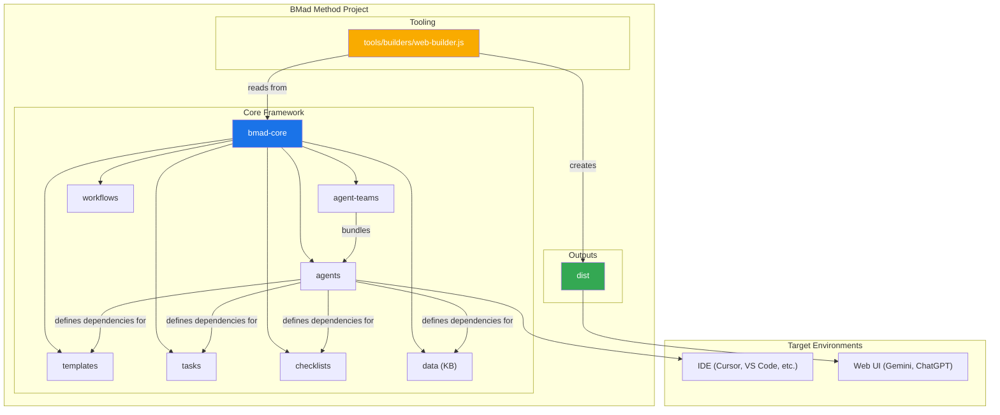
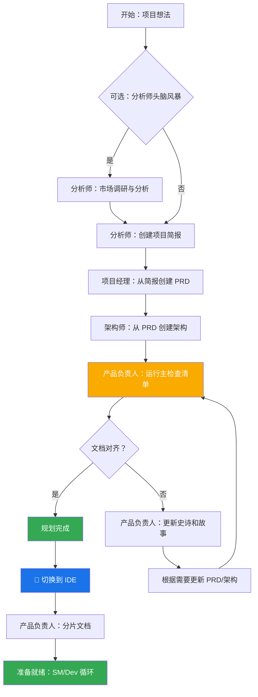
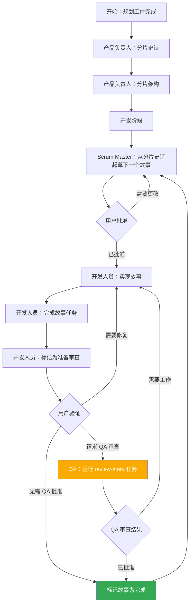

# BMad 方法：核心架构

## 1. 概述

BMad 方法旨在提供代理模式、任务和模板，以实现可重复的有用工作流程，无论是用于敏捷代理开发，还是扩展到完全不同的领域。该项目的核心目的是提供一套结构化但灵活的提示、模板和工作流程，用户可以用来指导 AI 代理（如 Gemini、Claude 或 ChatGPT）以可预测、高质量的方式执行复杂任务、引导讨论或其他有意义的特定领域流程。

系统核心模块促进了针对当前现代 AI 代理工具挑战的完整开发生命周期：

1. **构思与规划**：头脑风暴、市场调研和创建项目简报。
2. **架构与设计**：定义系统架构和 UI/UX 规范。
3. **开发执行**：一个循环工作流程，其中 Scrum Master (SM) 代理起草具有极其具体上下文的故事，Developer (Dev) 代理逐个实现它们。此过程适用于新项目（绿地）和现有项目（褐地）。

## 2. 系统架构图

整个 BMad-Method 生态系统围绕安装的 `bmad-core` 目录设计，该目录充当操作的大脑。`tools` 目录提供了在不同环境中处理和打包这个大脑的手段。

## 3. 核心组件

`bmad-core` 目录包含所有为代理提供能力的定义和资源。

### 3.1. 代理 (`bmad-core/agents/`)

- **目的**：这些是系统的基础构建块。每个 Markdown 文件（例如 `bmad-master.md`、`pm.md`、`dev.md`）定义单个 AI 代理的角色、能力和依赖关系。
- **结构**：代理文件包含一个 YAML 头部，指定其角色、角色设定、依赖关系和启动指令。这些依赖关系是代理可以使用的任务、模板、检查清单和数据文件的列表。
- **启动指令**：代理可以包含启动序列，从 `docs/` 文件夹加载特定于项目的文档，如编码标准、API 规范或项目结构文档。这在激活时提供即时项目上下文。
- **文档集成**：代理可以在任务、工作流程或启动序列中引用和加载项目 `docs/` 文件夹中的文档。用户还可以直接将文档拖拽到聊天界面中以提供额外上下文。
- **示例**：`bmad-master` 代理列出其依赖关系，告诉构建工具在 Web 包中包含哪些文件，并告知代理其自身的能力。

### 3.2. 代理团队 (`bmad-core/agent-teams/`)

- **目的**：团队文件（例如 `team-all.yaml`）定义了为特定目的（如"全栈开发"或"仅后端"）捆绑在一起的代理和工作流程集合。这为 Web UI 环境创建了一个更大的预打包上下文。
- **结构**：团队文件列出要包含的代理。它可以使用通配符，如 `"*"` 来包含所有代理。这允许创建综合包，如 `team-all`。

### 3.3. 工作流程 (`bmad-core/workflows/`)

- **目的**：工作流程是 YAML 文件（例如 `greenfield-fullstack.yaml`），为特定项目类型定义预定的步骤和代理交互序列。它们作为用户和 `bmad-orchestrator` 代理的战略指南。
- **结构**：工作流程定义了复杂和简单项目的序列，列出了每个步骤中涉及的代理、他们创建的工件以及从一个步骤移动到下一个步骤的条件。它通常包含一个用于可视化的 Mermaid 图表。

### 3.4. 可重用资源 (`templates`、`tasks`、`checklists`、`data`)

- **目的**：这些文件夹存放由代理根据其依赖关系动态加载的模块化组件。
  - **`templates/`**：包含常见文档的 Markdown 模板，如 PRD、架构规范和用户故事。
  - **`tasks/`**：定义执行特定、可重复操作的指令，如"shard-doc"或"create-next-story"。
  - **`checklists/`**：为产品负责人 (`po`) 或架构师等代理提供质量保证检查清单。
  - **`data/`**：包含核心知识库 (`bmad-kb.md`)、技术偏好 (`technical-preferences.md`) 和其他关键数据文件。

#### 3.4.1. 模板处理系统

BMad 的一个关键架构原则是模板是自包含和交互式的 - 它们嵌入了所需的文档输出和与用户协作所需的 LLM 指令。这意味着在许多情况下，文档创建不需要单独的任务，因为模板本身包含所有处理逻辑。

BMad 框架采用了一个由三个关键组件协调的复杂模板处理系统：

- **`template-format.md`** (`bmad-core/utils/`)：定义在整个 BMad 模板中使用的基 markup 语言。该规范建立了变量替换 (`{{placeholders}}`)、AI 专用处理指令 (`[[LLM: instructions]]`) 和条件逻辑块的语法规则。模板遵循此格式以确保整个系统的一致处理。

- **`create-doc.md`** (`bmad-core/tasks/`)：充当管理整个文档生成工作流程的编排引擎。此任务协调模板选择、管理用户交互模式（增量 vs. 快速生成）、执行模板格式处理规则和处理验证。它作为用户和模板系统之间的主要接口。

- **`advanced-elicitation.md`** (`bmad-core/tasks/`)：提供一个交互式优化层，可以通过 `[[LLM: instructions]]` 块嵌入模板中。该组件提供 10 个结构化头脑风暴动作、逐节审查功能和迭代改进工作流程，以提高内容质量。

该系统保持关注点的清晰分离：模板标记由 AI 代理内部处理但从不向用户暴露，同时通过模板本身嵌入的智能提供复杂的 AI 处理能力。

#### 3.4.2. 技术偏好系统

BMad 通过 `bmad-core/data/` 中的 `technical-preferences.md` 文件包含一个个性化层。此文件作为影响所有项目中代理行为的持久技术配置文件。

**目的和优势：**

- **一致性**：确保所有代理引用相同的技术偏好
- **效率**：消除重复指定首选技术的需要
- **个性化**：代理提供与用户偏好一致的建议
- **学习**：捕获从项目中学习的经验和偏好，随时间演变

**内容结构：**
该文件通常包括首选技术栈、设计模式、外部服务、编码标准和要避免的反模式。代理在规划和开发期间自动引用此文件，以提供上下文适当的建议。

**集成点：**

- 模板可以在文档生成期间引用技术偏好
- 代理在项目需求适当时建议首选技术
- 当偏好不符合项目需求时，代理解释替代方案
- Web 包可以包含偏好内容，以确保跨平台的一致行为

**随时间演变：**
鼓励用户持续更新此文件，添加从项目中发现的内容，包括正面偏好和要避免的技术，创建一个个性化的知识库，随着时间推移改进代理建议。

## 4. 构建和交付过程

该框架为两种主要环境设计：本地 IDE 和基于 Web 的 AI 聊天界面。`web-builder.js` 脚本是支持后者的钥匙。

### 4.1. Web 构建器 (`tools/builders/web-builder.js`)

- **目的**：这个 Node.js 脚本负责创建 `dist` 中的 `.txt` 包。
- **过程**：
  1. **解析依赖关系**：对于给定的代理或团队，脚本读取其定义文件。
  2. 它递归查找代理/团队需要的所有依赖资源（任务、模板等）。
  3. **打包内容**：它读取所有这些文件的内容并将它们连接成一个大的文本文件，用清晰的分隔符指示每个部分的原始文件路径。
  4. **输出包**：最终的 `.txt` 文件保存在 `dist` 目录中，准备上传到 Web UI。

### 4.2. 环境特定使用

- **对于 IDE**：用户通过 `bmad-core/agents/` 中的 Markdown 文件直接与代理交互。IDE 集成（用于 Cursor、Claude Code 等）知道如何调用这些代理。
- **对于 Web UI**：用户上传来自 `dist` 的预构建包。这个单一文件为 AI 提供整个团队及其所有所需工具和知识的上下文。

## 5. BMad 工作流程

### 5.1. 规划工作流程

在开发开始之前，BMad 遵循一个结构化规划工作流程，为成功的项目执行建立基础：

**关键规划阶段：**

1. **可选分析**：分析师进行市场调研和竞争分析
2. **项目简报**：由分析师或用户创建的基础文档
3. **PRD 创建**：项目经理将简报转化为全面的产品需求
4. **架构设计**：架构师基于 PRD 创建技术基础
5. **验证与对齐**：产品负责人确保所有文档一致且完整
6. **优化**：根据需要更新史诗、故事和文档
7. **环境转换**：从 Web UI 到 IDE 的关键切换，用于开发工作流程
8. **文档准备**：产品负责人分片大文档以供开发使用

**工作流程编排**：`bmad-orchestrator` 代理使用这些工作流程定义来引导用户完成完整过程，确保规划（Web UI）和开发（IDE）阶段之间的正确转换。

### 5.2. 核心开发周期

一旦初始规划和架构阶段完成，项目就进入循环开发工作流程，如 `bmad-kb.md` 中详细说明。这确保了稳定、顺序和质量受控的实现过程。

此循环继续进行，Scrum Master、开发人员和可选的 QA 代理一起工作。QA 代理通过 `review-story` 任务提供高级开发人员审查能力，提供代码重构、质量改进和知识传递。这确保了高质量代码，同时保持开发速度。