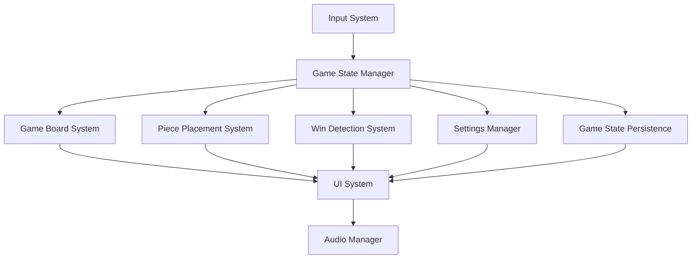

# Unity 2D Gomoku Game Architecture Document

## Introduction

This document outlines the complete technical architecture for the Unity 2D Gomoku game, a 2D game built with Unity and C#. It serves as the technical foundation for AI-driven game development, ensuring consistency and scalability across all game systems.

This architecture is designed to support the gameplay mechanics defined in the Product Requirements Document (PRD) while maintaining stable performance and cross-platform compatibility. The implementation will follow the BMAD-METHOD™ framework for consistent, high-quality development.

### Starter Template or Existing Project

N/A

### Change Log

| Date | Version | Description | Author |
|------|---------|-------------|---------|
| 2025-10-12 | v1.0 | Initial game architecture creation based on PRD | Pixel (Game Architect) |

## High Level Architecture

### Technical Summary

The Gomoku game follows a component-based Unity architecture with MonoBehaviour components, ScriptableObjects for data, and Unity Events for communication. Key game systems include the Game Board System, Piece Placement System, Win Detection System, Game State Manager, and UI System. The primary technology choices are Unity 2022.3 LTS as the game engine, C# 10.0 as the programming language, and Universal Render Pipeline (URP) for rendering. The architecture follows Unity's native component system, leveraging prefabs and the asset pipeline for efficient development.

### High Level Overview

The game follows a component-based Unity architecture with MonoBehaviour components for game logic. The repository structure is a single Unity project containing all game assets, code, and documentation. The game system architecture uses modular systems with singleton managers (Game Manager, Audio Manager) and data-driven design with ScriptableObjects for game configuration. The primary player interaction flow is: Main Menu → Game Scene (with pause functionality) → Game Results. Key architectural decisions include using the Universal Render Pipeline for optimal 2D performance, Unity's Input System for cross-platform input handling, and Unity Events for system decoupling.

### High Level Project Diagram



### Architectural and Design Patterns

- **Component-Based Architecture:** Using MonoBehaviour components for game logic - _Rationale:_ Aligns with Unity's design philosophy and enables reusable, testable game systems
- **ScriptableObject Data:** Using ScriptableObjects for game configuration - _Rationale:_ Enables data-driven design and easy balancing without code changes
- **Event-Driven Communication:** Using Unity Events and C# events for system decoupling - _Rationale:_ Supports modular architecture and easier testing

## Tech Stack

### Platform Infrastructure

- **Target Platforms:** Windows, Mac, Web
- **Primary Platform:** Desktop (Windows/Mac)
- **Platform Services:** None required for MVP
- **Distribution:** Standalone executables, Web build

### Technology Stack Table

| Category | Technology | Version | Purpose | Rationale |
|----------|------------|---------|---------|-----------|
| **Game Engine** | Unity | 2022.3.21f1 | Core game development platform | Latest LTS version, stable 2D tooling, comprehensive package ecosystem |
| **Language** | C# | 10.0 | Primary scripting language | Unity's native language, strong typing, excellent tooling |
| **Render Pipeline** | Universal Render Pipeline (URP) | 14.0.10 | 2D/3D rendering | Optimized for mobile, excellent 2D features, future-proof |
| **Input System** | Unity Input System | 1.7.0 | Cross-platform input handling | Modern input system, supports multiple devices, rebindable controls |
| **Physics** | Unity 2D Physics | Built-in | 2D collision and physics | Integrated Box2D, optimized for 2D games |
| **Audio** | Unity Audio | Built-in | Audio playback and mixing | Built-in audio system with mixer support |
| **Testing** | Unity Test Framework | 1.1.33 | Unit and integration testing | Built-in testing framework based on NUnit |

## Game Data Models

### GameBoardModel

**Purpose:** Represents the state of the 15x15 Gomoku game board

**Key Attributes:**
- `grid`: int[,] - 15x15 array storing piece states (0=empty, 1=black, 2=white)
- `currentPlayer`: int - Tracks which player's turn it is (1=black, 2=white)
- `moveHistory`: List<Vector2Int> - Stores the sequence of moves for undo functionality

**Relationships:**
- Connected to Piece Placement System for move validation
- Connected to Win Detection System for victory checking
- Connected to Game State Manager for state transitions

**ScriptableObject Implementation:**
- Create as `[CreateAssetMenu]` ScriptableObject
- Store in `Assets/_Project/Data/GameBoard/`

### GameSettingsModel

**Purpose:** Stores configurable game settings such as audio volume and UI preferences

**Key Attributes:**
- `masterVolume`: float - Master volume level (0.0-1.0)
- `sfxVolume`: float - Sound effects volume level (0.0-1.0)
- `musicVolume`: float - Music volume level (0.0-1.0)
- `enableAnimations`: bool - Whether UI animations are enabled
- `enableSoundEffects`: bool - Whether sound effects are enabled

**Relationships:**
- Connected to Audio Manager for volume control
- Connected to UI System for visual feedback

**ScriptableObject Implementation:**
- Create as `[CreateAssetMenu]` ScriptableObject
- Store in `Assets/_Project/Data/GameSettings/`

## Game Systems & Components

### Game State Manager System

**Responsibility:** Manages the overall game state and transitions between states (MainMenu, Playing, Paused, GameOver)

**Key Components:**
- GameStateManager (MonoBehaviour)
- GameState (ScriptableObject)
- GameManager (Manager/Controller)

**Unity Implementation Details:**
- Lifecycle: Initialized in Awake(), handles state transitions in Update()
- Events: Uses Unity Events to notify other systems of state changes
- Dependencies: Depends on UI System for screen transitions, Audio Manager for feedback

**Files to Create:**
- `Assets/_Project/Scripts/GameState/GameStateManager.cs`
- `Assets/_Project/Prefabs/GameState/GameStateManager.prefab`

### Game Board System

**Responsibility:** Handles the rendering and interaction with the 15x15 game board

**Key Components:**
- GameBoard (MonoBehaviour)
- BoardRenderer (MonoBehaviour)
- IntersectionDetector (MonoBehaviour)

**Unity Implementation Details:**
- Lifecycle: Board initialized in Start(), intersection detection in Update()
- Events: Fires events when valid intersections are clicked
- Dependencies: Depends on Piece Placement System for move execution, Game State Manager for state validation

**Files to Create:**
- `Assets/_Project/Scripts/GameBoard/GameBoard.cs`
- `Assets/_Project/Prefabs/GameBoard/GameBoard.prefab`

### Piece Placement System

**Responsibility:** Manages the placement of black and white pieces on valid board intersections

**Key Components:**
- PiecePlacement (MonoBehaviour)
- Piece (MonoBehaviour)
- TurnManager (MonoBehaviour)

**Unity Implementation Details:**
- Lifecycle: Turn management in Update(), piece instantiation in LateUpdate()
- Events: Uses Unity Events to communicate piece placement and turn changes
- Dependencies: Depends on Game Board System for intersection validation, Win Detection System for victory checking

**Files to Create:**
- `Assets/_Project/Scripts/Piece/PiecePlacement.cs`
- `Assets/_Project/Prefabs/Piece/Piece.prefab`

### Win Detection System

**Responsibility:** Detects when five pieces are connected in a row (horizontally, vertically, or diagonally)

**Key Components:**
- WinDetector (MonoBehaviour)
- VictoryEffect (MonoBehaviour)
- WinCondition (ScriptableObject)

**Unity Implementation Details:**
- Lifecycle: Win detection performed after each move in LateUpdate()
- Events: Fires victory event when win condition is met
- Dependencies: Depends on Game Board System for board state, Piece Placement System for move history

**Files to Create:**
- `Assets/_Project/Scripts/Win/WinDetector.cs`
- `Assets/_Project/Prefabs/Win/VictoryEffect.prefab`

### UI System

**Responsibility:** Manages all user interface elements including main menu, in-game UI, pause menu, and game results

**Key Components:**
- UIManager (MonoBehaviour)
- ScreenManager (MonoBehaviour)
- ButtonHandler (MonoBehaviour)

**Unity Implementation Details:**
- Lifecycle: Screen initialization in Start(), button handling in Update()
- Events: Uses Unity Events for button clicks and screen transitions
- Dependencies: Depends on Game State Manager for state awareness, Audio Manager for feedback

**Files to Create:**
- `Assets/_Project/Scripts/UI/UIManager.cs`
- `Assets/_Project/Prefabs/UI/UIManager.prefab`

### Audio System

**Responsibility:** Manages all audio playback including piece placement sounds, victory sounds, and menu interactions

**Key Components:**
- AudioManager (MonoBehaviour)
- AudioSourcePool (MonoBehaviour)
- AudioSettings (ScriptableObject)

**Unity Implementation Details:**
- Lifecycle: Audio sources initialized in Awake(), playback handled in Update()
- Events: Uses Unity Events to trigger sound effects
- Dependencies: Depends on Game State Manager for context, UI System for interaction feedback

**Files to Create:**
- `Assets/_Project/Scripts/Audio/AudioManager.cs`
- `Assets/_Project/Prefabs/Audio/AudioManager.prefab`

## Gameplay Systems Architecture

### Gameplay Systems Overview

**Core Game Loop:** Player starts game from main menu → Game board initialized → Players take turns placing pieces → Win detection runs after each move → Game ends when win condition is met or board is full → Results displayed with replay option

**Player Actions:** Click on valid board intersections to place pieces, click undo button to undo last move, click pause button to access pause menu, adjust settings via settings menu

**Game State Flow:** MainMenu → Playing → [Paused] → GameOver → [MainMenu or Restart]

### Gameplay Component Architecture

**Player Controller Components:**
- GameBoard
- PiecePlacement
- TurnManager

**Game Logic Components:**
- WinDetector
- GameStateManager
- SettingsManager

**Interaction Systems:**
- InputSystem
- UIManager
- AudioManager

## Component Architecture Details

### MonoBehaviour Patterns

**Component Composition:** Components are designed with single responsibilities and composed together on GameObjects. For example, the GameBoard GameObject has GameBoard, BoardRenderer, and IntersectionDetector components.

**Lifecycle Management:** Components follow Unity's lifecycle with initialization in Awake() or Start(), gameplay logic in Update() or LateUpdate(), and cleanup in OnDestroy().

**Component Communication:** Components communicate primarily through Unity Events for loose coupling, with direct references used only for performance-critical paths.

### ScriptableObject Architecture

**Data Architecture:** ScriptableObjects are used for all game configuration data including game settings, audio settings, and game rules. This enables data-driven design and easy balancing.

**Configuration Management:** Configuration ScriptableObjects are created in the Editor and referenced by managers at runtime. Default configurations are provided for all settings.

**Runtime Data:** Runtime data that persists across scenes (like game settings) is stored in ScriptableObjects, while transient game state (like the current board) is managed by the GameStateManager.

## Physics Configuration

### Physics Settings

**Physics 2D Settings:** Default Unity 2D Physics settings will be used with the following customizations:
- Gravity set to (0, 0) since this is a board game with no gravity
- Layer Collision Matrix configured to prevent unnecessary collision checks between game pieces

**Collision Layers:** Custom layers will be created for:
- BoardIntersections
- GamePieces
- UIElements

**Physics Materials:** A custom physics material with zero friction and bounciness will be created for game pieces to prevent unintended physics interactions.

### Rigidbody Patterns

**Player Physics:** Game pieces will use Rigidbody2D with Kinematic body type since they are moved programmatically rather than by physics forces.

**Object Physics:** The game board and UI elements will not use Rigidbody2D as they are static elements.

**Performance Optimization:** Object pooling will be implemented for game piece GameObjects to minimize instantiation/destruction overhead during gameplay.

## Input System Architecture

### Input Actions Configuration

**Input Action Assets:** A single Input Actions asset will be created with the following action maps:
- Player: Contains "PlacePiece" action for mouse/touch input
- UI: Contains "Navigate" and "Submit" actions for menu navigation

**Action Maps:** Two action maps will be defined:
- Player: Handles in-game piece placement
- UI: Handles menu navigation and selection

**Control Schemes:** Two control schemes will be defined:
- MouseAndKeyboard: For desktop play
- Touch: For mobile/tablet play

### Input Handling Patterns

**Player Input:** The PlayerInput component will be attached to the GameBoard GameObject and configured to use Unity Events. The "PlacePiece" action will be connected to the PiecePlacement component's HandlePiecePlacement method.

**UI Input:** The PlayerInput component will be attached to the UIManager GameObject for menu interactions. UI navigation will use Unity's built-in navigation system with the Input System.

**Input Validation:** Input will be validated at the component level - the PiecePlacement component will only accept input when the game state is "Playing" and the clicked intersection is valid and unoccupied.

## State Machine Architecture

### Game State Machine

**Game States:** The game will have the following states:
- MainMenu
- Playing
- Paused
- GameOver

**State Transitions:**
- MainMenu → Playing: When "Start Game" button is clicked
- Playing → Paused: When pause button is clicked or ESC key is pressed
- Paused → Playing: When "Resume" button is clicked
- Paused → MainMenu: When "Return to Menu" button is clicked
- Playing → GameOver: When win condition is met or board is full
- GameOver → MainMenu: When "Main Menu" button is clicked
- GameOver → Playing: When "Play Again" button is clicked

**State Management:** The GameStateManager will use a simple state pattern with a current state enum and switch statements to handle state-specific logic and transitions.

### Entity State Machines

**Player States:** Players will have a simple state machine with states:
- Idle
- PlacingPiece
- Waiting

**AI Behavior States:** Not applicable for MVP (local multiplayer only)

**Object States:** Game pieces will have states:
- Placed
- Removed (for undo functionality)

## UI Architecture

### UI System Selection

**UI Framework:** UGUI (Unity UI) - _Rationale:_ UGUI is Unity's standard UI system, well-documented, and sufficient for the game's relatively simple UI needs. UI Toolkit would be overkill for this project.

**UI Scaling:** Canvas set to "Scale With Screen Size" with reference resolution of 1920x1080 to ensure proper scaling across different screen sizes.

**Canvas Setup:** Single canvas with Screen Space - Overlay rendering mode. Canvas scaler configured for high DPI displays.

### UI Navigation System

**Screen Management:** The UIManager will manage screen activation/deactivation using GameObject.SetActive(). Only one screen will be active at a time.

**Navigation Flow:** Linear navigation flow between main menu, game screen, pause menu, and game results screen. Each screen has clearly defined navigation options.

**Back Button Handling:** The ESC key will trigger the appropriate action based on current state: pause game when playing, resume game when paused, return to main menu from pause menu.

## UI Component System

### UI Component Library

**Base Components:**
- Button
- Text
- Image
- Slider (for volume controls)

**Custom Components:**
- TurnIndicator
- MoveCounter
- VictoryBanner

**Component Prefabs:** All UI components will be created as prefabs in the Prefabs/UI folder for reuse across screens.

### UI Data Binding

**Data Binding Patterns:** UI elements will be updated through direct references from the UIManager to specific components. For example, the TurnIndicator will be updated by the UIManager calling a method on the TurnIndicator component.

**UI Events:** Unity Events will be used for button clicks, with listeners configured in the Inspector.

**View Model Patterns:** A simple view model pattern will be used where the UIManager acts as the view model, holding references to UI elements and updating them based on game state.

## UI State Management

### UI State Patterns

**State Persistence:** UI state (such as volume slider positions) will be saved to PlayerPrefs and restored on game startup.

**Screen State:** Each screen will have its own state management, with the UIManager responsible for initializing each screen when activated.

**UI Configuration:** UI appearance settings (like animation toggles) will be stored in the GameSettingsModel ScriptableObject.

## Scene Management Architecture

### Scene Structure

**Scene Organization:** Three main scenes will be used:
- MainMenu.unity
- GameScene.unity
- LoadingScene.unity (minimal scene for async loading)

**Scene Hierarchy:** Each scene will have a similar hierarchy with:
- Managers (GameStateManager, AudioManager, etc.)
- UI Canvas
- Game elements (GameBoard, etc.)

**Persistent Scenes:** The GameManager and AudioManager will use DontDestroyOnLoad to persist across scenes.

### Scene Loading System

**Loading Strategies:** Scenes will be loaded using SceneManager.LoadScene() for synchronous loading between main menu and game, and SceneManager.LoadSceneAsync() for async loading when performance is critical.

**Async Loading:** Async loading will be implemented with a loading screen that shows progress. The loading process will be managed by a SceneLoader singleton.

**Loading Screens:** A simple loading screen with a progress bar will be displayed during async scene loading to provide feedback to the player.

## Data Persistence Architecture

### Save Data Structure

**Save Data Models:** Game settings will be saved using PlayerPrefs. No complex save data is needed for MVP as game state is not persisted between sessions.

**Serialization Format:** PlayerPrefs will be used for settings persistence as it is Unity's built-in solution for simple data storage.

**Data Validation:** Settings data will be validated on load, with default values used if corrupted or missing.

### Persistence Strategy

**Save Triggers:** Settings will be saved when they are changed in the settings menu.

**Auto-Save:** Not applicable for MVP.

**Cloud Save:** Not applicable for MVP.

## Save System Implementation

### Save/Load API

**Save Interface:** Simple SaveSettings() method in SettingsManager that serializes settings to PlayerPrefs.

**Load Interface:** LoadSettings() method in SettingsManager that deserializes settings from PlayerPrefs.

**Error Handling:** Try-catch blocks will be used around save/load operations with fallback to default settings if an error occurs.

### Save File Management

**File Structure:** Settings will be stored in PlayerPrefs with keys prefixed with "Gomoku." to avoid conflicts.

**Backup Strategy:** Not applicable for simple settings storage.

**Migration:** Not applicable for MVP.

## Rendering Pipeline Configuration

### Render Pipeline Setup

**Pipeline Choice:** Universal Render Pipeline (URP) - _Rationale:_ URP is optimized for 2D games, provides excellent performance, and is the recommended pipeline for new Unity projects.

**Pipeline Asset:** A custom URP asset will be created with 2D renderer configured for optimal sprite rendering.

**Quality Settings:** Quality settings will be configured with multiple levels (Low, Medium, High) that can be selected in settings to balance visual quality and performance.

### Rendering Optimization

**Batching Strategies:** Static batching will be enabled for UI elements and game board. Dynamic batching will be used for game pieces when possible.

**Draw Call Optimization:** Sprite atlases will be created for all game sprites to minimize draw calls.

**Texture Optimization:** Textures will be compressed using ASTC format for mobile and RGBA32 for desktop to balance quality and memory usage.

## Shader Guidelines

### Shader Usage Patterns

**Built-in Shaders:** Standard URP shaders will be used for most materials. The Universal Render Pipeline/Lit shader will be used for game pieces with simple lighting effects.

**Custom Shaders:** A simple custom shader will be created for the victory highlight effect that animates a glow around the winning pieces.

**Shader Variants:** Shader variants will be minimized by avoiding unnecessary keywords and using shader stripping in build settings.

### Shader Performance Guidelines

**Mobile Optimization:** Shaders will be tested on mobile devices with reduced complexity (fewer instructions, simpler lighting calculations).

**Performance Budgets:** Shaders will be kept under 100 instructions for mobile compatibility.

**Profiling Guidelines:** Shaders will be profiled using Unity's Frame Debugger and Profiler to identify performance bottlenecks.

## Sprite Management

### Sprite Organization

**Atlas Strategy:** A single sprite atlas will be created for all game sprites (board, pieces, UI elements) to minimize draw calls.

**Sprite Naming:** Sprites will be named descriptively with prefixes indicating their type (e.g., "piece_black", "ui_button_normal").

**Import Settings:** Sprites will be imported with "Sprite (2D and UI)" type, compression appropriate for target platform, and pivot set to center.

### Sprite Optimization

**Compression Settings:** Sprites will use Crunch compression for editor and platform-appropriate compression (ASTC for mobile, RGBA32 for desktop) for builds.

**Resolution Strategy:** Sprites will be created at 2x the maximum display size to support high-DPI displays, with Mip Maps disabled for 2D games.

**Memory Optimization:** Sprite memory usage will be minimized by using appropriate compression and texture sizes, with sprite atlases reducing overhead.

## Particle Systems

### Particle System Design

**Effect Categories:** Particle effects will be used for:
- Piece placement (small impact effect)
- Victory celebration (confetti effect)

**Prefab Organization:** Particle system prefabs will be stored in Prefabs/Effects/ with descriptive names.

**Pooling Strategy:** A generic object pool will be implemented for particle system GameObjects to avoid instantiation overhead during gameplay.

### Particle Performance

**Performance Budgets:** Particle systems will be limited to 50 particles maximum to maintain 60 FPS on target hardware.

**Mobile Optimization:** Particle count and complexity will be reduced on mobile devices through platform-specific settings.

**LOD Strategy:** Particle effects will be simplified or disabled on low-end devices based on quality settings.

## Audio Architecture

### Audio System Design

**Audio Manager:** A singleton AudioManager will manage all audio playback with separate audio sources for music, sound effects, and UI sounds.

**Audio Sources:** Multiple audio sources will be used to allow concurrent playback of different sound types.

**3D Audio:** Not applicable for 2D board game.

### Audio Categories

**Music System:** Background music will loop during gameplay with smooth transitions between states.

**Sound Effects:** Short sound effects will play for piece placement, button clicks, and victory.

**Voice/Dialog:** Not applicable for MVP.

## Audio Mixing Configuration

### Audio Mixer Setup

**Mixer Groups:** The audio mixer will have separate groups for:
- Master
- Music
- SFX
- UI

**Effects Chain:** Simple effects chain with volume control and optional low-pass filter for music.

**Snapshot System:** Snapshots will be used to quickly switch between different mixer states (e.g., normal gameplay vs. muted).

### Dynamic Audio Mixing

**Volume Control:** Volume sliders in settings will adjust the volume of each mixer group independently.

**Dynamic Range:** Dynamic range will be managed through mixer snapshots that adjust volume levels based on game context.

**Platform Optimization:** Audio quality settings will be adjusted based on target platform capabilities.

## Sound Bank Management

### Sound Asset Organization

**Bank Structure:** Sound assets will be organized in folders by category:
- Music
- SFX
- UI

**Loading Strategy:** Sounds will be loaded on demand at startup and kept in memory for responsive playback.

**Memory Management:** Audio memory usage will be monitored and optimized by using appropriate compression formats (Ogg Vorbis for music, PCM for short SFX).

### Audio Streaming

**Streaming Strategy:** Music will be streamed from disk to minimize memory usage, while short sound effects will be loaded completely into memory.

**Compression Settings:** Music will use Ogg Vorbis compression at 64kbps for balance of quality and file size.

**Platform Considerations:** Streaming settings will be adjusted based on platform capabilities and storage constraints.

## Unity Development Conventions

### Unity Best Practices

**Component Design:** Components will follow single responsibility principle with clear, focused functionality.

**Performance Guidelines:** Performance-critical code will avoid allocations in Update loops and use object pooling for frequently instantiated objects.

**Memory Management:** Memory usage will be minimized by avoiding unnecessary allocations and properly disposing of resources.

### Unity Workflow Conventions

**Scene Workflow:** Scenes will be kept simple with minimal elements, using prefabs for reusable components.

**Prefab Workflow:** All reusable game objects will be created as prefabs with properly configured component references.

**Asset Workflow:** Assets will be organized in a logical folder structure following Unity best practices.

## Infrastructure and Deployment

### Unity Build Configuration

- **Unity Version:** 2022.3 LTS
- **Build Pipeline:** Unity's built-in build system
- **Addressables:** Not used for MVP
- **Asset Bundles:** Not used for MVP

### Deployment Strategy

- **Build Automation:** Manual builds for development, automated builds for releases
- **Version Control:** Git with GitHub for version control
- **Distribution:** Standalone builds for Windows/Mac, WebGL build for web distribution

### Build Environments

- **Development:** Development build with debug symbols, script debugging enabled
- **Staging:** Release build with minimal logging
- **Production:** Release build with full optimization

### Platform-Specific Build Settings

```
// Windows Build Settings
- Target Platform: Windows
- Architecture: x86_64
- Compression Method: LZ4
- Resolution: 1920x1080 (default)
- Fullscreen Mode: Exclusive Fullscreen

// Mac Build Settings
- Target Platform: Mac
- Architecture: x86_64
- Compression Method: LZ4
- Resolution: 1920x1080 (default)
- Fullscreen Mode: Fullscreen Window

// WebGL Build Settings
- Target Platform: WebGL
- Compression Format: Brotli
- Resolution: 1280x720 (default)
- Web GL Version: 2.0
```

## Coding Standards

### Core Standards

- **Unity Version:** 2022.3 LTS
- **C# Language Version:** 10.0
- **Code Style:** Microsoft C# conventions + Unity naming
- **Testing Framework:** Unity Test Framework (NUnit-based)

### Unity Naming Conventions

| Element | Convention | Example |
|--------|------------|---------|
| MonoBehaviour | PascalCase + Component suffix | PlayerController, HealthSystem |
| ScriptableObject | PascalCase + Data/Config suffix | PlayerData, GameConfig |
| Prefab | PascalCase descriptive | PlayerCharacter, EnvironmentTile |

### Critical Unity Rules

- **Cache GetComponent calls:** Always cache GetComponent calls in Awake() or Start()
- **SerializeField for Inspector access:** Use [SerializeField] for private fields that need Inspector access
- **UnityEvents for callbacks:** Prefer UnityEvents over C# events for Inspector-assignable callbacks
- **Avoid GameObject.Find:** Never call GameObject.Find() in Update, FixedUpdate, or LateUpdate
- **DontDestroyOnLoad for managers:** Use DontDestroyOnLoad() for persistent managers like GameManager
- **Object pooling for frequent instantiation:** Use object pooling for frequently instantiated objects like game pieces and particle effects

### Unity-Specific Guidelines

**Unity Lifecycle Rules:**
- **Awake:** Use for initialization that must happen before any Start() calls
- **Start:** Use for initialization that depends on other components being initialized
- **Update:** Use for frame-based logic like input handling
- **FixedUpdate:** Use for physics-related logic
- **LateUpdate:** Use for camera or UI updates that should happen after all Update methods

## Test Strategy and Standards

### Testing Philosophy

- **Approach:** Test-after approach for MVP, with unit tests for critical game logic and integration tests for system interactions
- **Coverage Goals:** 80% coverage for game logic components, 50% coverage for UI components
- **Test Distribution:** 70% Edit Mode tests, 30% Play Mode tests

### Unity Test Types and Organization

**Edit Mode Tests**
- **Framework:** Unity Test Framework (Edit Mode)
- **File Convention:** [ComponentName]Tests.cs
- **Location:** `Assets/_Project/Tests/EditMode/`
- **Purpose:** C# logic testing without Unity runtime
- **Coverage Requirement:** Test all public methods and edge cases for game logic components

**Play Mode Tests**
- **Framework:** Unity Test Framework (Play Mode)
- **Location:** `Assets/_Project/Tests/PlayMode/`
- **Purpose:** Integration testing with Unity runtime
- **Test Scenes:** Dedicated test scenes for each major system
- **Coverage Requirement:** Test scene transitions, UI interactions, and system integrations

### Test Data Management

- **Strategy:** Use ScriptableObjects as test fixtures for consistent test data
- **ScriptableObject Fixtures:** Store in `Assets/_Project/Tests/Data/`
- **Test Scene Templates:** Create reusable test scenes with common game configurations
- **Cleanup Strategy:** Reset game state after each test to ensure isolation

## Security Considerations

### Save Data Security

- **Encryption:** Not required for simple settings storage
- **Validation:** Settings data will be validated on load with default values as fallback
- **Anti-Tampering:** Not applicable for MVP

### Platform Security Requirements

- **Mobile Permissions:** No special permissions required
- **Store Compliance:** Will comply with platform store requirements for data collection and privacy
- **Privacy Policy:** Simple privacy policy will be included stating no personal data is collected

## Next Steps

### Game Developer Prompt

Create the following game systems based on the architecture document:

1. Implement the Game State Manager system with states: MainMenu, Playing, Paused, GameOver
2. Create the Game Board System with 15x15 grid rendering and intersection detection
3. Develop the Piece Placement System with turn management and valid move validation
4. Implement the Win Detection System with horizontal, vertical, and diagonal win checking
5. Build the UI System with main menu, in-game UI, pause menu, and game results screens
6. Create the Audio System with background music and sound effects for gameplay events

Adhere to the coding standards and architectural patterns defined in this document. Use MonoBehaviour components for game logic, ScriptableObjects for configuration data, and Unity Events for system communication. Follow the file structure and naming conventions specified in the Unity Project Structure section. Implement unit tests for game logic components and integration tests for system interactions.