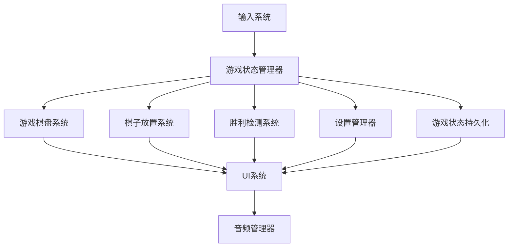

# Unity 2D五子棋游戏架构文档

## 简介

本文档概述了Unity 2D五子棋游戏的完整技术架构，这是一个使用Unity和C#构建的2D游戏。它作为AI驱动游戏开发的技术基础，确保所有游戏系统的持续性和可扩展性。

该架构旨在支持产品需求文档(PRD)中定义的游戏机制，同时保持稳定的性能和跨平台兼容性。实现将遵循BMAD-METHOD™框架，以确保一致的高质量开发。

### 起始模板或现有项目

N/A

### 变更日志

| 日期 | 版本 | 描述 | 作者 |
|------|---------|-------------|---------|
| 2025-10-12 | v1.0 | 基于PRD创建初始游戏架构 | Pixel (游戏架构师) |

## 高层架构

### 技术摘要

五子棋游戏遵循基于组件的Unity架构，使用MonoBehaviour组件、ScriptableObjects存储数据，以及Unity事件进行通信。关键游戏系统包括游戏棋盘系统、棋子放置系统、胜利检测系统、游戏状态管理器和UI系统。主要技术选择是Unity 2022.3 LTS作为游戏引擎，C# 10.0作为编程语言，通用渲染管线(URP)用于渲染。架构遵循Unity原生组件系统，利用预制件和资源管线进行高效开发。

### 高层概述

游戏遵循基于组件的Unity架构，使用MonoBehaviour组件处理游戏逻辑。仓库结构是包含所有游戏资源、代码和文档的单个Unity项目。游戏系统架构使用模块化系统，包含单例管理器（游戏管理器、音频管理器）和使用ScriptableObjects的数据驱动设计。主要玩家交互流程是：主菜单→游戏场景（带暂停功能）→游戏结果。关键架构决策包括使用通用渲染管线实现最佳2D性能，使用Unity输入系统处理跨平台输入，以及使用Unity事件实现系统解耦。

### 高层项目图



### 架构和设计模式

- **基于组件的架构**：使用MonoBehaviour组件处理游戏逻辑 - _理由_：符合Unity的设计理念，能够实现可重用、可测试的游戏系统
- **ScriptableObject数据**：使用ScriptableObjects存储游戏配置 - _理由_：实现数据驱动设计，无需修改代码即可轻松调整平衡
- **事件驱动通信**：使用Unity事件和C#事件实现系统解耦 - _理由_：支持模块化架构和更轻松的测试

## 技术栈

### 平台基础设施

- **目标平台**：Windows, Mac, Web
- **主要平台**：桌面（Windows/Mac）
- **平台服务**：MVP不需要
- **分发**：独立可执行文件，Web构建

### 技术栈表

| 类别 | 技术 | 版本 | 目的 | 理由 |
|----------|------------|---------|---------|-----------|
| **游戏引擎** | Unity | 2022.3.21f1 | 核心游戏开发平台 | 最新LTS版本，稳定的2D工具，全面的包生态系统 |
| **语言** | C# | 10.0 | 主要脚本语言 | Unity的原生语言，强类型，优秀的工具支持 |
| **渲染管线** | 通用渲染管线 (URP) | 14.0.10 | 2D/3D渲染 | 针对移动端优化，出色的2D功能，面向未来 |
| **输入系统** | Unity输入系统 | 1.7.0 | 跨平台输入处理 | 现代输入系统，支持多种设备，可重新绑定的控制 |
| **物理** | Unity 2D物理 | 内置 | 2D碰撞和物理 | 集成Box2D，针对2D游戏优化 |
| **音频** | Unity音频 | 内置 | 音频播放和混音 | 内置音频系统，支持混音器 |
| **测试** | Unity测试框架 | 1.1.33 | 单元和集成测试 | 基于NUnit的内置测试框架 |

## 游戏数据模型

### GameBoardModel

**目的**：表示15x15五子棋游戏棋盘的状态

**关键属性**：
- `grid`：int[,] - 15x15数组存储棋子状态（0=空，1=黑，2=白）
- `currentPlayer`：int - 跟踪轮到哪位玩家（1=黑，2=白）
- `moveHistory`：List<Vector2Int> - 存储移动序列以支持撤销功能

**关系**：
- 与棋子放置系统连接以验证移动
- 与胜利检测系统连接以检查胜利
- 与游戏状态管理器连接以进行状态转换

**ScriptableObject实现**：
- 作为`[CreateAssetMenu]` ScriptableObject创建
- 存储在`Assets/_Project/Data/GameBoard/`

### GameSettingsModel

**目的**：存储可配置的游戏设置，如音频音量和UI偏好

**关键属性**：
- `masterVolume`：float - 主音量级别（0.0-1.0）
- `sfxVolume`：float - 音效音量级别（0.0-1.0）
- `musicVolume`：float - 音乐音量级别（0.0-1.0）
- `enableAnimations`：bool - 是否启用UI动画
- `enableSoundEffects`：bool - 是否启用音效

**关系**：
- 与音频管理器连接以控制音量
- 与UI系统连接以提供视觉反馈

**ScriptableObject实现**：
- 作为`[CreateAssetMenu]` ScriptableObject创建
- 存储在`Assets/_Project/Data/GameSettings/`

## 游戏系统与组件

### 游戏状态管理器系统

**职责**：管理整体游戏状态并在状态之间转换（主菜单、游戏中、暂停、游戏结束）

**关键组件**：
- GameStateManager (MonoBehaviour)
- GameState (ScriptableObject)
- GameManager (管理器/控制器)

**Unity实现细节**：
- 生命周期：在Awake()中初始化，在Update()中处理状态转换
- 事件：使用Unity事件通知其他系统状态变化
- 依赖：依赖UI系统进行屏幕转换，依赖音频管理器进行反馈

**要创建的文件**：
- `Assets/_Project/Scripts/GameState/GameStateManager.cs`
- `Assets/_Project/Prefabs/GameState/GameStateManager.prefab`

### 游戏棋盘系统

**职责**：处理15x15游戏棋盘的渲染和交互

**关键组件**：
- GameBoard (MonoBehaviour)
- BoardRenderer (MonoBehaviour)
- IntersectionDetector (MonoBehaviour)

**Unity实现细节**：
- 生命周期：棋盘在Start()中初始化，交点检测在Update()中进行
- 事件：在有效交点被点击时触发事件
- 依赖：依赖棋子放置系统执行移动，依赖游戏状态管理器进行状态验证

**要创建的文件**：
- `Assets/_Project/Scripts/GameBoard/GameBoard.cs`
- `Assets/_Project/Prefabs/GameBoard/GameBoard.prefab`

### 棋子放置系统

**职责**：管理在有效棋盘交点上放置黑白棋子

**关键组件**：
- PiecePlacement (MonoBehaviour)
- Piece (MonoBehaviour)
- TurnManager (MonoBehaviour)

**Unity实现细节**：
- 生命周期：在Update()中进行回合管理，在LateUpdate()中进行棋子实例化
- 事件：使用Unity事件通信棋子放置和回合变化
- 依赖：依赖游戏棋盘系统进行交点验证，依赖胜利检测系统进行胜利检查

**要创建的文件**：
- `Assets/_Project/Scripts/Piece/PiecePlacement.cs`
- `Assets/_Project/Prefabs/Piece/Piece.prefab`

### 胜利检测系统

**职责**：检测何时五个棋子连成一线（水平、垂直或对角线）

**关键组件**：
- WinDetector (MonoBehaviour)
- VictoryEffect (MonoBehaviour)
- WinCondition (ScriptableObject)

**Unity实现细节**：
- 生命周期：在每次移动后的LateUpdate()中执行胜利检测
- 事件：当满足胜利条件时触发胜利事件
- 依赖：依赖游戏棋盘系统获取棋盘状态，依赖棋子放置系统获取移动历史

**要创建的文件**：
- `Assets/_Project/Scripts/Win/WinDetector.cs`
- `Assets/_Project/Prefabs/Win/VictoryEffect.prefab`

### UI系统

**职责**：管理所有用户界面元素，包括主菜单、游戏内UI、暂停菜单和游戏结果

**关键组件**：
- UIManager (MonoBehaviour)
- ScreenManager (MonoBehaviour)
- ButtonHandler (MonoBehaviour)

**Unity实现细节**：
- 生命周期：在Start()中初始化屏幕，在Update()中处理按钮
- 事件：使用Unity事件处理按钮点击和屏幕转换
- 依赖：依赖游戏状态管理器了解状态，依赖音频管理器进行反馈

**要创建的文件**：
- `Assets/_Project/Scripts/UI/UIManager.cs`
- `Assets/_Project/Prefabs/UI/UIManager.prefab`

### 音频系统

**职责**：管理所有音频播放，包括棋子放置声音、胜利声音和菜单交互

**关键组件**：
- AudioManager (MonoBehaviour)
- AudioSourcePool (MonoBehaviour)
- AudioSettings (ScriptableObject)

**Unity实现细节**：
- 生命周期：在Awake()中初始化音频源，在Update()中处理播放
- 事件：使用Unity事件触发音效
- 依赖：依赖游戏状态管理器获取上下文，依赖UI系统获取交互反馈

**要创建的文件**：
- `Assets/_Project/Scripts/Audio/AudioManager.cs`
- `Assets/_Project/Prefabs/Audio/AudioManager.prefab`

## 游戏玩法系统架构

### 游戏玩法系统概述

**核心游戏循环**：玩家从主菜单开始游戏→初始化游戏棋盘→玩家轮流放置棋子→每次移动后运行胜利检测→当满足胜利条件或棋盘满时游戏结束→显示结果并提供重玩选项

**玩家操作**：点击有效棋盘交点放置棋子，点击撤销按钮撤销上一步，点击暂停按钮访问暂停菜单，通过设置菜单调整设置

**游戏状态流**：主菜单→游戏中→[暂停]→游戏结束→[主菜单或重新开始]

### 游戏玩法组件架构

**玩家控制器组件**：
- GameBoard
- PiecePlacement
- TurnManager

**游戏逻辑组件**：
- WinDetector
- GameStateManager
- SettingsManager

**交互系统**：
- InputSystem
- UIManager
- AudioManager

## 组件架构细节

### MonoBehaviour模式

**组件组合**：组件设计为单一职责，并在GameObject上组合。例如，GameBoard GameObject包含GameBoard、BoardRenderer和IntersectionDetector组件。

**生命周期管理**：组件遵循Unity的生命周期，在Awake()或Start()中初始化，在Update()或LateUpdate()中处理游戏逻辑，在OnDestroy()中清理。

**组件通信**：组件主要通过Unity事件进行通信以实现松耦合，仅在性能关键路径上使用直接引用。

### ScriptableObject架构

**数据架构**：ScriptableObjects用于所有游戏配置数据，包括游戏设置、音频设置和游戏规则。这实现了数据驱动设计和轻松平衡。

**配置管理**：在编辑器中创建配置ScriptableObjects，并在运行时由管理器引用。为所有设置提供默认配置。

**运行时数据**：在场景间持久化的运行时数据（如游戏设置）存储在ScriptableObjects中，而临时游戏状态（如当前棋盘）由GameStateManager管理。

## 物理配置

### 物理设置

**2D物理设置**：将使用默认Unity 2D物理设置并进行以下自定义：
- 重力设置为(0, 0)，因为这是棋盘游戏，没有重力
- 层碰撞矩阵配置为防止游戏棋子之间不必要的碰撞检查

**碰撞层**：将为以下内容创建自定义层：
- BoardIntersections
- GamePieces
- UIElements

**物理材质**：将为游戏棋子创建一个零摩擦和弹性的自定义物理材质，以防止意外的物理交互。

### Rigidbody模式

**玩家物理**：游戏棋子将使用Rigidbody2D，类型为Kinematic，因为它们是通过程序移动而不是物理力。

**对象物理**：游戏棋盘和UI元素不会使用Rigidbody2D，因为它们是静态元素。

**性能优化**：将为游戏棋子GameObject实现对象池，以最小化游戏过程中的实例化/销毁开销。

## 输入系统架构

### 输入动作配置

**输入动作资源**：将创建一个单一的输入动作资源，包含以下动作映射：
- 玩家：包含用于鼠标/触摸输入的"PlacePiece"动作
- UI：包含用于菜单导航的"Navigate"和"Submit"动作

**动作映射**：将定义两个动作映射：
- 玩家：处理游戏中的棋子放置
- UI：处理菜单导航和选择

**控制方案**：将定义两个控制方案：
- MouseAndKeyboard：用于桌面游戏
- Touch：用于移动/平板游戏

### 输入处理模式

**玩家输入**：PlayerInput组件将附加到GameBoard GameObject上，并配置为使用Unity事件。"PlacePiece"动作将连接到PiecePlacement组件的HandlePiecePlacement方法。

**UI输入**：PlayerInput组件将附加到UIManager GameObject上以处理菜单交互。UI导航将使用Unity内置的导航系统与输入系统配合。

**输入验证**：将在组件级别验证输入 - PiecePlacement组件只有在游戏状态为"Playing"且点击的交点有效且未被占据时才会接受输入。


## 状态机架构

### 游戏状态机

**游戏状态**：游戏将具有以下状态：
- MainMenu
- Playing
- Paused
- GameOver

**状态转换**：
- MainMenu → Playing：当点击"开始游戏"按钮时
- Playing → Paused：当点击暂停按钮或按下ESC键时
- Paused → Playing：当点击"恢复"按钮时
- Paused → MainMenu：当点击"返回主菜单"按钮时
- Playing → GameOver：当满足胜利条件或棋盘满时
- GameOver → MainMenu：当点击"主菜单"按钮时
- GameOver → Playing：当点击"再玩一次"按钮时

**状态管理**：GameStateManager将使用简单的状态模式，通过当前状态枚举和switch语句处理特定于状态的逻辑和转换。

### 实体状态机

**玩家状态**：玩家将有一个简单的状态机，包含状态：
- Idle
- PlacingPiece
- Waiting

**AI行为状态**：MVP不适用（仅本地多人游戏）

**对象状态**：游戏棋子将有状态：
- Placed
- Removed (用于撤销功能)

## UI架构

### UI系统选择

**UI框架**：UGUI (Unity UI) - _理由_：UGUI是Unity的标准UI系统，文档完善，足以满足游戏相对简单的UI需求。UI Toolkit对此项目来说过于复杂。

**UI缩放**：画布设置为"随屏幕大小缩放"，参考分辨率为1920x1080，以确保在不同屏幕尺寸上正确缩放。

**画布设置**：单个画布，渲染模式为屏幕空间-覆盖。画布缩放器配置为高DPI显示器。

### UI导航系统

**屏幕管理**：UIManager将使用GameObject.SetActive()管理屏幕的激活/停用。一次只有一个屏幕处于活动状态。

**导航流程**：在主菜单、游戏屏幕、暂停菜单和游戏结果屏幕之间进行线性导航。每个屏幕都有明确定义的导航选项。


**返回按钮处理**：ESC键将根据当前状态触发适当操作：游戏中时暂停游戏，暂停时恢复游戏，从暂停菜单返回主菜单。

## UI组件系统

### UI组件库

**基础组件**：
- Button
- Text
- Image
- Slider (用于音量控制)

**自定义组件**：
- TurnIndicator
- MoveCounter
- VictoryBanner

**组件预制件**：所有UI组件将作为预制件创建在Prefabs/UI文件夹中，以便在屏幕间重用。

### UI数据绑定

**数据绑定模式**：UI元素将通过UIManager对特定组件的直接引用进行更新。例如，TurnIndicator将通过UIManager调用TurnIndicator组件上的方法来更新。

**UI事件**：Unity事件将用于按钮点击，在检查器中配置监听器。

**视图模型模式**：将使用简单的视图模型模式，其中UIManager充当视图模型，持有对UI元素的引用并根据游戏状态更新它们。


## UI状态管理

### UI状态模式

**状态持久化**：UI状态（如音量滑块位置）将保存到PlayerPrefs并在游戏启动时恢复。

**屏幕状态**：每个屏幕都有自己的状态管理，UIManager负责在激活时初始化每个屏幕。

**UI配置**：UI外观设置（如动画切换）将存储在GameSettingsModel ScriptableObject中。

## 场景管理架构

### 场景结构

**场景组织**：将使用三个主要场景：
- MainMenu.unity
- GameScene.unity
- LoadingScene.unity (用于异步加载的最小场景)

**场景层级**：每个场景都有类似的层级结构，包含：
- 管理器 (GameStateManager, AudioManager等)
- UI画布
- 游戏元素 (GameBoard等)

**持久场景**：GameManager和AudioManager将使用DontDestroyOnLoad在场景间持久化。

### 场景加载系统

**加载策略**：将使用SceneManager.LoadScene()在主菜单和游戏之间进行同步加载，使用SceneManager.LoadSceneAsync()在性能关键时进行异步加载。

**异步加载**：将使用显示进度的加载屏幕实现异步加载。加载过程将由SceneLoader单例管理。

**加载屏幕**：在异步场景加载期间将显示带有进度条的简单加载屏幕，为玩家提供反馈。


## 数据持久化架构

### 保存数据结构

**保存数据模型**：游戏设置将使用PlayerPrefs保存。MVP不需要复杂的保存数据，因为游戏状态不在会话间持久化。

**序列化格式**：将使用PlayerPrefs进行设置持久化，因为它是Unity内建的简单数据存储解决方案。

**数据验证**：将在加载时验证设置数据，如果损坏或缺失则使用默认值。

### 持久化策略

**保存触发器**：在设置菜单中更改设置时将保存。

**自动保存**：MVP不适用。

**云保存**：MVP不适用。

## 保存系统实现

### 保存/加载API

**保存接口**：SettingsManager中的简单SaveSettings()方法，将设置序列化到PlayerPrefs。

**加载接口**：SettingsManager中的LoadSettings()方法，从PlayerPrefs反序列化设置。

**错误处理**：在保存/加载操作周围使用try-catch块，如果发生错误则回退到默认设置。

### 保存文件管理

**文件结构**：设置将存储在PlayerPrefs中，键以"Gomoku."为前缀以避免冲突。

**备份策略**：不适用于简单的设置存储。

**迁移**：MVP不适用。

## 渲染管线配置

### 渲染管线设置

**管线选择**：通用渲染管线 (URP) - _理由_：URP针对2D游戏优化，提供出色的性能，是新Unity项目的推荐管线。

**管线资源**：将创建一个自定义URP资源，配置2D渲染器以实现最佳精灵渲染。

**质量设置**：质量设置将配置多个级别（低、中、高），可在设置中选择以平衡视觉质量和性能。

### 渲染优化

**批处理策略**：将为UI元素和游戏棋盘启用静态批处理。尽可能为游戏棋子使用动态批处理。

**绘制调用优化**：将为所有游戏精灵创建精灵图集以最小化绘制调用。

**纹理优化**：纹理将使用ASTC格式压缩以用于移动设备，使用RGBA32格式以用于桌面端，以平衡质量和内存使用。

## 着色器指南

### 着色器使用模式

**内置着色器**：大多数材质将使用标准URP着色器。通用渲染管线/光照着色器将用于游戏棋子，带有简单的光照效果。

**自定义着色器**：将为胜利高亮效果创建一个简单的自定义着色器，围绕获胜棋子动画发光。

**着色器变体**：将通过避免不必要的关键字和在构建设置中使用着色器剥离来最小化着色器变体。

### 着色器性能指南

**移动优化**：将在移动设备上测试着色器，降低复杂性（更少的指令，更简单的光照计算）。

**性能预算**：为了移动兼容性，着色器将保持在100条指令以下。

**分析指南**：将使用Unity的帧调试器和分析器分析着色器，以识别性能瓶颈。

## 精灵管理

### 精灵组织

**图集策略**：将为所有游戏精灵（棋盘、棋子、UI元素）创建一个精灵图集，以最小化绘制调用。

**精灵命名**：精灵将使用描述性名称，前缀表示其类型（如"piece_black"，"ui_button_normal"）。

**导入设置**：精灵将以"精灵(2D和UI)"类型导入，根据目标平台使用适当的压缩，枢轴点设置为中心。

### 精灵优化

**压缩设置**：精灵将在编辑器中使用Crunch压缩，在构建时使用平台适当的压缩（移动设备用ASTC，桌面端用RGBA32）。

**分辨率策略**：精灵将以最大显示尺寸的2倍创建，以支持高DPI显示器，2D游戏禁用Mip地图。

**内存优化**：通过使用适当的压缩和纹理尺寸来最小化精灵内存使用，精灵图集减少开销。

## 粒子系统

### 粒子系统设计

**效果类别**：粒子效果将用于：
- 棋子放置（小冲击效果）
- 胜利庆祝（彩纸效果）

**预制件组织**：粒子系统预制件将存储在Prefabs/Effects/中，带有描述性名称。

**池策略**：将为粒子系统GameObject实现一个通用对象池，以避免游戏过程中的实例化开销。


### 粒子性能

**性能预算**：为了在目标硬件上保持60 FPS，粒子系统将限制在最多50个粒子。

**移动优化**：在移动设备上通过平台特定设置降低粒子数量和复杂性。

**LOD策略**：在低端设备上根据质量设置简化或禁用粒子效果。


## 音频架构

### 音频系统设计

**音频管理器**：单例AudioManager将管理所有音频播放，为音乐、音效和UI声音使用单独的音频源。

**音频源**：将使用多个音频源，允许不同类型声音的并发播放。

**3D音频**：2D棋盘游戏不适用。

### 音频类别

**音乐系统**：背景音乐将在游戏过程中循环播放，状态之间有平滑过渡。

**音效**：短音效将在棋子放置、按钮点击和胜利时播放。

**语音/对话**：MVP不适用。

## 音频混合配置

### 音频混音器设置

**混音器组**：音频混音器将有以下单独的组：
- 主
- 音乐
- 音效
- UI

**效果链**：简单的效果链，带有音量控制和音乐的可选低通滤波器。

**快照系统**：将使用快照快速在不同的混音器状态之间切换（如正常游戏与静音）。

### 动态音频混合

**音量控制**：设置中的音量滑块将独立调整每个混音器组的音量。

**动态范围**：将通过混音器快照管理动态范围，根据游戏上下文调整音量级别。

**平台优化**：根据目标平台能力调整音频质量设置。

## 音效库管理

### 音效资产组织

**库结构**：音效资产将按类别在文件夹中组织：
- 音乐
- 音效
- UI

**加载策略**：声音将在启动时按需加载并保留在内存中，以实现响应式播放。

**内存管理**：将通过使用适当的压缩格式（音乐用Ogg Vorbis，短音效用PCM）监控和优化音频内存使用。


### 音频流

**流策略**：音乐将从磁盘流式传输以最小化内存使用，而短音效将完全加载到内存中。

**压缩设置**：音乐将使用64kbps的Ogg Vorbis压缩，以平衡质量和文件大小。

**平台考虑**：根据平台能力和存储限制调整流设置。

## Unity开发规范

### Unity最佳实践

**组件设计**：组件将遵循单一职责原则，具有清晰、集中的功能。

**性能指南**：性能关键代码将避免在Update循环中分配，并为频繁实例化的对象使用对象池。

**内存管理**：通过避免不必要的分配和正确释放资源来最小化内存使用。

### Unity工作流程规范

**场景工作流程**：场景将保持简单，元素最少，使用预制件用于可重用组件。

**预制件工作流程**：所有可重用的游戏对象将作为预制件创建，正确配置组件引用。

**资产工作流程**：资产将按照Unity最佳实践组织在逻辑文件夹结构中。

## 基础设施和部署

### Unity构建配置

- **Unity版本**：2022.3 LTS
- **构建管线**：Unity内置构建系统
- **可寻址资源**：MVP不使用
- **资源包**：MVP不使用

### 部署策略

- **构建自动化**：开发时手动构建，发布时自动构建
- **版本控制**：使用GitHub的Git进行版本控制
- **分发**：Windows/Mac的独立构建，WebGL构建用于Web分发

### 构建环境

- **开发**：带有调试符号的开发构建，启用脚本调试
- **预发布**：带有最小日志的发布构建
- **生产**：带有完全优化的发布构建

### 平台特定构建设置

```
// Windows构建设置
- 目标平台：Windows
- 架构：x86_64
- 压缩方法：LZ4
- 分辨率：1920x1080 (默认)
- 全屏模式：独占全屏

// Mac构建设置
- 目标平台：Mac
- 架构：x86_64
- 压缩方法：LZ4
- 分辨率：1920x1080 (默认)
- 全屏模式：全屏窗口

// WebGL构建设置
- 目标平台：WebGL
- 压缩格式：Brotli
- 分辨率：1280x720 (默认)
- Web GL版本：2.0
```

## 编码标准

### 核心标准

- **Unity版本**：2022.3 LTS
- **C#语言版本**：10.0
- **代码风格**：Microsoft C#规范 + Unity命名
- **测试框架**：Unity测试框架 (基于NUnit)

### Unity命名规范

| 元素 | 规范 | 示例 |
|--------|------------|---------|
| MonoBehaviour | PascalCase + 组件后缀 | PlayerController, HealthSystem |
| ScriptableObject | PascalCase + Data/Config后缀 | PlayerData, GameConfig |
| 预制件 | 描述性PascalCase | PlayerCharacter, EnvironmentTile |

### 关键Unity规则

- **缓存GetComponent调用**：始终在Awake()或Start()中缓存GetComponent调用
- **SerializeField用于检查器访问**：对于需要检查器访问的私有字段使用[SerializeField]
- **UnityEvents用于回调**：优先使用UnityEvents而不是C#事件用于检查器可分配的回调
- **避免GameObject.Find**：不要在Update、FixedUpdate或LateUpdate中调用GameObject.Find()
- **DontDestroyOnLoad用于管理器**：对GameManager等持久管理器使用DontDestroyOnLoad()
- **对象池用于频繁实例化**：对频繁实例化的对象（如游戏棋子和粒子效果）使用对象池

### Unity特定指南

**Unity生命周期规则**：
- **Awake**：用于必须在任何Start()调用之前发生的初始化
- **Start**：用于依赖其他组件初始化的初始化
- **Update**：用于基于帧的逻辑，如输入处理
- **FixedUpdate**：用于物理相关逻辑
- **LateUpdate**：用于应在所有Update方法之后发生的相机或UI更新

## 测试策略和标准

### 测试理念

- **方法**：MVP采用测试后方法，关键游戏逻辑进行单元测试，系统交互进行集成测试
- **覆盖率目标**：游戏逻辑组件80%覆盖率，UI组件50%覆盖率
- **测试分布**：70%编辑模式测试，30%播放模式测试

### Unity测试类型和组织

**编辑模式测试**
- **框架**：Unity测试框架（编辑模式）
- **文件规范**：[ComponentName]Tests.cs
- **位置**：`Assets/_Project/Tests/EditMode/`
- **目的**：无需Unity运行时的C#逻辑测试
- **覆盖率要求**：测试游戏逻辑组件的所有公共方法和边缘情况

**播放模式测试**
- **框架**：Unity测试框架（播放模式）
- **位置**：`Assets/_Project/Tests/PlayMode/`
- **目的**：与Unity运行时的集成测试
- **测试场景**：每个主要系统有专用测试场景
- **覆盖率要求**：测试场景转换、UI交互和系统集成

### 测试数据管理

- **策略**：使用ScriptableObjects作为测试夹具，以获得一致的测试数据
- **ScriptableObject夹具**：存储在`Assets/_Project/Tests/Data/`
- **测试场景模板**：创建带有常见游戏配置的可重用测试场景
- **清理策略**：每个测试后重置游戏状态以确保隔离

## 安全考虑

### 保存数据安全

- **加密**：简单设置存储不需要
- **验证**：加载时验证设置数据，以默认值作为回退
- **防篡改**：MVP不适用

### 平台安全要求

- **移动权限**：不需要特殊权限
- **商店合规**：将遵守平台商店关于数据收集和隐私的要求
- **隐私政策**：将包含简单的隐私政策，说明不收集个人数据

## 下一步

### 游戏开发者提示

根据此架构文档创建以下游戏系统：

1. 实现具有以下状态的游戏状态管理器系统：主菜单、游戏中、暂停、游戏结束
2. 创建带有15x15网格渲染和交点检测的游戏棋盘系统
3. 开发带有回合管理和有效移动验证的棋子放置系统
4. 实现带有水平、垂直和对角线胜利检查的胜利检测系统
5. 构建带有主菜单、游戏内UI、暂停菜单和游戏结果屏幕的UI系统
6. 创建带有背景音乐和游戏事件音效的音频系统

遵守本文档中定义的编码标准和架构模式。使用MonoBehaviour组件处理游戏逻辑，使用ScriptableObjects存储配置数据，使用Unity事件进行系统通信。遵循Unity项目结构部分中指定的文件结构和命名规范。为游戏逻辑组件实现单元测试，为系统交互实现集成测试。